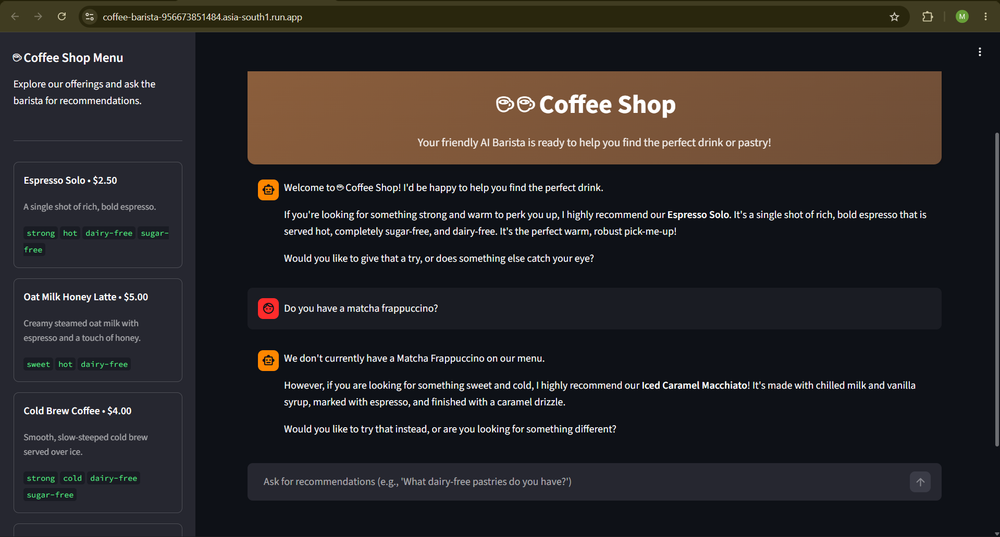

# ☕ AI Coffee Barista Agent

> A customer-facing AI Coffee Barista Agent built with Google ADK, Gemini, RAG, Streamlit, and Google Cloud Run.

[](https://cloud.google.com/run)
[](https://ai.google.dev/)
[](https://www.python.org/)
[](https://streamlit.io/)

## 🚀 Live Demo

### 👉 [☕ Try the AI Coffee Barista](https://coffee-barista-956673851484.asia-south1.run.app/)

---

## 📸 Project Demo



---

## 📌 About the Project

The **AI Coffee Barista Agent** is a conversational AI application that helps customers discover suitable coffee and bakery items from a predefined menu.

The agent uses a local menu dataset as its knowledge source so that it can provide grounded responses instead of inventing products that are not available.

The application is deployed as a publicly accessible service using **Google Cloud Run**.

---

## ✨ Features

- ☕ Coffee and bakery recommendations
- 🔍 Menu-grounded AI responses
- 🚫 Prevents recommendations for unavailable products
- 🥛 Allergen-aware recommendations
- 💬 Natural language conversations
- 🤖 Gemini-powered responses
- 📚 RAG-style grounding using menu data
- ☁️ Cloud Run deployment
- 🎨 Streamlit web interface

---

## 🧪 Example Queries

### 1. Product Recommendation

**User:**
> I want something strong and cold.

**Agent:**
Recommends suitable cold and strong drinks available in the menu.

### 2. Out-of-Menu Product

**User:**
> Do you have a matcha frappuccino?

**Agent:**
The agent identifies that the item is not available in the provided menu instead of hallucinating a product.

### 3. Dietary / Allergen Requirement

**User:**
> I'm lactose intolerant. What can I have?

**Agent:**
The agent uses the menu's allergen information to recommend suitable options.

---

## 🏗️ Architecture

```text
                    ┌─────────────────────┐
                    │       User          │
                    │  Natural Language   │
                    └──────────┬──────────┘
                               │
                               ▼
                    ┌─────────────────────┐
                    │   Streamlit UI      │
                    │      app.py         │
                    └──────────┬──────────┘
                               │
                               ▼
                    ┌─────────────────────┐
                    │   Google ADK Agent  │
                    │      agent.py       │
                    └──────────┬──────────┘
                               │
                     ┌─────────┴─────────┐
                     │                   │
                     ▼                   ▼
             ┌──────────────┐    ┌──────────────┐
             │    Gemini    │    │  Menu Data   │
             │     Model    │    │  menu.json   │
             └──────────────┘    └──────────────┘
                     │                   │
                     └─────────┬─────────┘
                               ▼
                    ┌─────────────────────┐
                    │ Grounded AI Response│
                    └─────────────────────┘
                               │
                               ▼
                    ┌─────────────────────┐
                    │   Google Cloud Run   │
                    └─────────────────────┘
